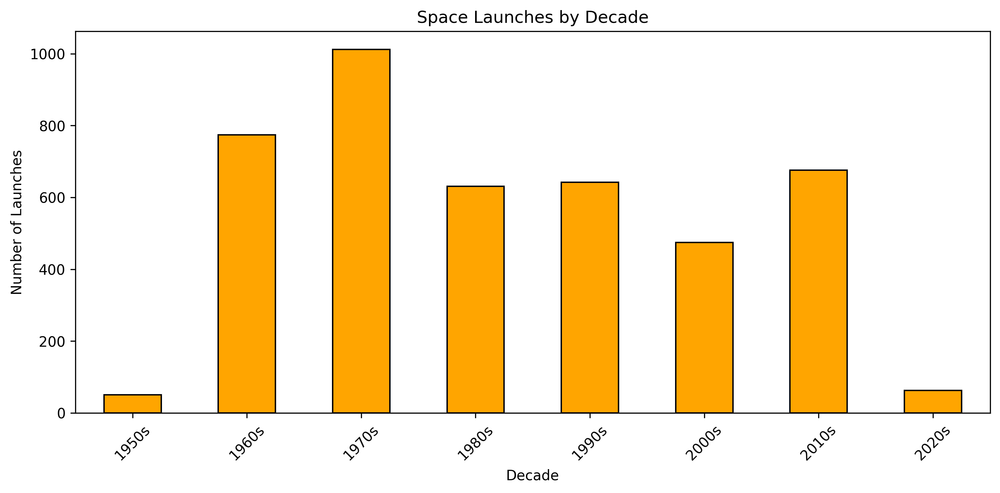
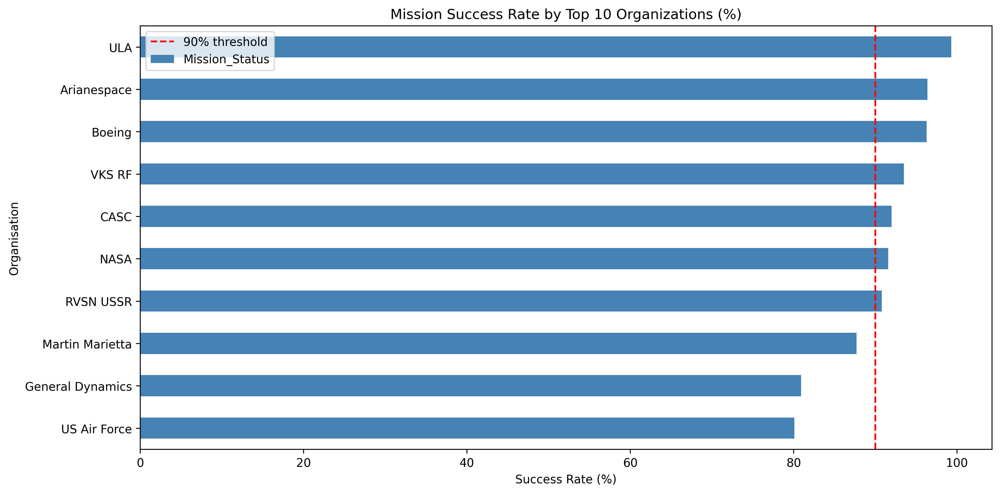
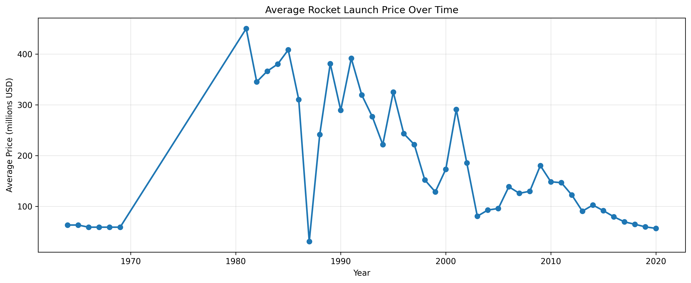

# Space Mission Launches - Business Insights
**Dataset:** 4,324 space missions  
**Analysis by:** Brandy Steals  
**Date:** May 18, 2026

## Executive Summary
This analysis examines 4,324 space mission launches across multiple organizations and decades. Key findings reveal that launch activity peaked dramatically in the 1970s before declining, organizational success rates vary significantly (with lesser-known ULA outperforming household names), and launch costs have dropped substantially over the past decade.

## Key Finding 1: Launch Volume Over Time
Launches gradually increased through the mid-20th century, peaking in the 1970s with **1,012 launches** - the only decade to exceed 1,000 launches. Volume has steadily declined since, with only approximately 63 launches in the 2020s so far.

## Key Finding 2: Organization Performance
The top 3 performers by mission success rate were:
1. **ULA** - 99.3%
2. **Arianespace** - 96.4%
3. **Boeing** - 96.3%

Surprisingly, NASA did not appear in the top 3 despite high name recognition. ULA, while less publicly known, demonstrates exceptional reliability - suggesting that brand recognition does not necessarily correlate with operational performance.

## Key Finding 3: Launch Costs
Launch costs have decreased significantly over the past decade. Average launch price dropped from **$146.6 million in 2011** to **$56.7 million in 2020** - a reduction of approximately 61%. This trend may reflect technological advances, increased competition (particularly from private companies), and improved efficiency in space launch operations.

## Interesting Observations
- The 1970s stands alone as the only decade exceeding 1,000 launches - what drove this peak? Possible factors include Cold War-era space competition and major government investment.
- Public awareness of launches has decreased, aligning with the lower launch volumes observed in the 2020s data.
- The price decline raises questions: Is this driven by economies of scale, technological innovation (reusable rockets), or shifts toward smaller, more efficient payloads?

## Questions for Further Investigation
- What share of recent launches comes from private companies versus government agencies?
- Does the success rate correlate with launch frequency? (Do organizations that launch more often achieve higher reliability?)
- How does the missing price data (78% of dataset) impact our cost trend conclusions?

## Data Quality Notes
- Dataset had mixed date formats (fixed with `format='mixed'`)
- Mixed timezones (standardized to UTC)
- Price column stored as string (converted to float)
- ~3,375 rows missing price data (78% of dataset) - cost analysis based on available 949 records

## Tools Used
- Python (pandas, matplotlib)
- Tableau Public
- Jupyter Notebook